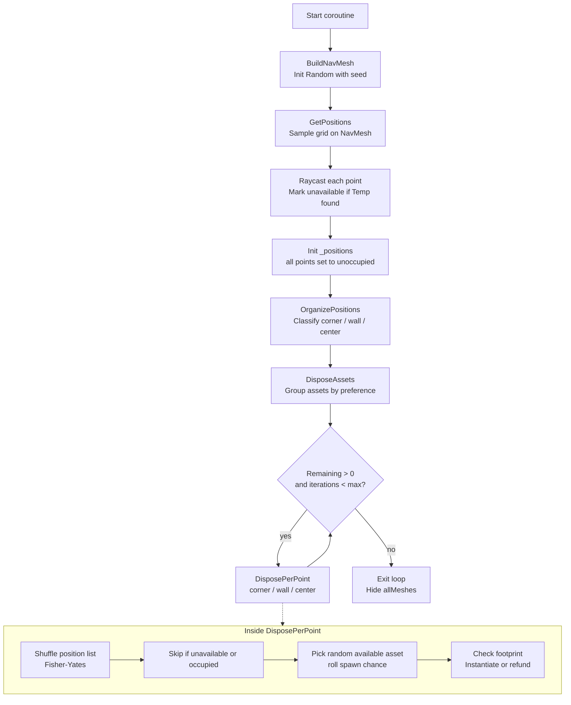

```mermaid
flowchart TD
    A[Start coroutine] --> B[BuildNavMesh<br/>Init Random with seed]
    B --> C[GetPositions<br/>Sample grid on NavMesh]
    C --> D[Raycast each point<br/>Mark unavailable if Temp found]
    D --> E[Init _positions<br/>all points set to unoccupied]
    E --> F[OrganizePositions<br/>Classify corner / wall / center]
    F --> G[DisposeAssets<br/>Group assets by preference]
    G --> H{Remaining > 0<br/>and iterations < max?}
    H -- yes --> I[DisposePerPoint<br/>corner / wall / center]
    I --> H
    H -- no --> J[Exit loop<br/>Hide allMeshes]

    subgraph K[Inside DisposePerPoint]
        K1[Shuffle position list<br/>Fisher-Yates] --> K2[Skip if unavailable or occupied]
        K2 --> K3[Pick random available asset<br/>roll spawn chance]
        K3 --> K4[Check footprint<br/>Instantiate or refund]
    end

    I -.-> K
```